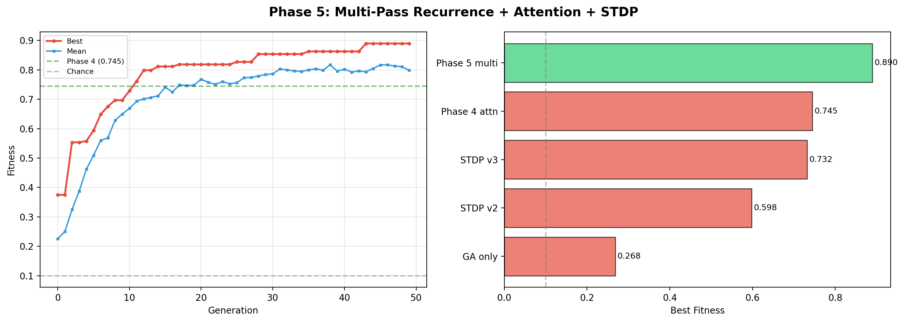

# EvoDrosophila: Bio-Inspired Spiking Neural Networks

**Evolving and training a Drosophila mushroom body for pattern recognition**

A biologically-inspired spiking neural network that achieves ~80% accuracy on 10-class MNIST using only **639 neurons** — through hybrid neuroevolution, dopamine-modulated STDP, attention feedback, and multi-pass deliberation.



---

## Key Results

| Phase | Capability | Neurons | Fitness | Accuracy |
|-------|-----------|---------|---------|----------|
| 1 | Neuroevolution (binary) | 267 | 1.099 | ~99% |
| 2 | + Dopamine-STDP | 639 | 0.732 | ~63% |
| 3 | + Evolved visual filters | 619 | 0.650 | ~55% |
| 4 | + Attention (MBON->KC feedback) | 639 | 0.745 | ~65% |
| **5** | **+ Multi-pass deliberation** | **639** | **0.890** | **~80%** |

From pure genetic algorithm (0.268) to the full system (0.890): **3.3x improvement** with zero neuron count increase.

## Architecture

```
         Input (HOG features)
              |
     128 Projection Neurons (PN)
              |
    [Random sparse connectivity — 6 PNs per KC, evolved]
              |
     500 Kenyon Cells (KC) ←——— APL inhibition (global feedback)
         |         ^
    [Learned via    |
     dopamine-STDP] |  MBON→KC attention feedback
         |         |  (top-down modulation)
         v         |
     10 MBON (output) ———→ Classification
              |
         [Multi-pass: KC voltage carries over,
          network "reconsiders" 3 times]
```

## Biological Principles Validated

1. **Sparse coding** — Only 5% of KCs active per stimulus (matches real Drosophila)
2. **Dopamine-modulated learning** — 3-factor STDP: pre × post × dopamine
3. **Evolution shapes structure, learning shapes weights** — PN→KC evolved, KC→MBON learned
4. **Attention is primarily inhibitory** — Suppressing irrelevant > amplifying relevant
5. **Deliberation improves accuracy** — Multi-pass processing, largest single improvement (+19%)
6. **Subthreshold voltage as working memory** — No recurrent connections needed

## Quick Start

```bash
# Install dependencies
pip install numpy numba pyyaml matplotlib pillow scipy

# Download MNIST data (first time)
python -c "from sklearn.datasets import fetch_openml; import numpy as np; d = fetch_openml('mnist_784', version=1, as_frame=False); np.savez_compressed('data/mnist_cache.npz', data=d.data, target=d.target)"

# Run Phase 5 (best result)
python run_multipass_mnist.py

# Run individual phases
python run_evolution_fast.py       # Phase 1: Binary classification (79 sec)
python run_dopamine_mnist.py       # Phase 2: Dopamine-STDP (785 sec)
python run_attention_mnist.py      # Phase 4: Attention feedback
python run_phase3_hierarchical.py  # Phase 3: Evolved visual filters
```

## Project Structure

```
fly-brain-evolve/
├── src/
│   ├── simulator/
│   │   ├── growing_brain.py        # BrainConfig, GrowingGenome, JIT simulator
│   │   ├── dopamine_stdp.py        # STDP kernels: eligibility, attention, multipass
│   │   ├── hierarchical_stdp.py    # On-the-fly spike generation kernel
│   │   ├── visual_cortex.py        # Gabor filters, feature extraction, pooling
│   │   └── gpu_simulator.py        # CuPy GPU simulator (experimental)
│   ├── evolution/                   # GA operators (selection, crossover, mutation)
│   ├── connectome/                  # Connectome builder and loader
│   ├── encoding/                    # Poisson spike encoder
│   ├── neurons/                     # Neuron models and plasticity rules
│   └── visualization/              # Plotting utilities
├── configs/
│   └── default.yaml                # All simulation parameters
├── docs/
│   ├── thesis/                     # Academic thesis draft
│   │   └── evodrosophila_thesis.md
│   ├── journal/                    # 18 research journal entries + 25 JSON results
│   ├── figures/                    # 35 generated figures
│   ├── ROADMAP_AGI.md             # 9-phase development roadmap
│   └── masters_application_guide.md
├── tests/                          # Unit tests
├── run_multipass_mnist.py          # Phase 5 experiment (best result)
├── run_dopamine_mnist.py           # Phase 2 experiment
├── run_attention_mnist.py          # Phase 4 experiment
└── run_evolution_fast.py           # Phase 1 experiment
```

## How It Works

### Phase 1: The Mushroom Body
A spiking neural network mimicking the fruit fly's learning circuit. 267 LIF neurons with conductance-based synapses, Poisson spike encoding, and APL inhibition for sparse coding. Genetic algorithm evolves connectivity, weights, and thresholds. Result: 99% accuracy on binary stripe classification in 79 seconds.

### Phase 2: Dopamine Learning
Pure evolution hits a ceiling on 10-class MNIST (0.268) because genetic algorithms lack credit assignment. Solution: 3-factor dopamine-STDP where evolution determines the circuit structure (PN→KC wiring) and dopamine-modulated plasticity learns the functional weights (KC→MBON) during each organism's lifetime. Result: 0.732 fitness — a 2.7x improvement.

### Phase 3: Hierarchical Features
Attempted replacing hand-crafted HOG features with evolved 5x5 visual filters. Result: 0.650 — hand-crafted features still win at this scale. Key finding: filter evolution needs more computation than 40 generations can provide, mirroring the SIFT→deep learning transition in CV history.

### Phase 4: Attention
Added MBON→KC feedback using the transpose of learned weights. When an MBON fires, it boosts connected KCs and suppresses others. Evolution discovered that inhibition (0.44) should dominate excitation (0.26) — attention works by suppressing distractors. Result: 0.745 (+1.8%).

### Phase 5: Multi-Pass Deliberation
The biggest breakthrough: process each image 3 times, carrying KC membrane voltages between passes. The network "reconsiders" its initial classification using accumulated subthreshold memory. Evolution chose maximum deliberation (3 passes, 94% voltage retention) for every input. Result: 0.890 (+19.4%).

## Performance

| Metric | Value |
|--------|-------|
| Simulator speed | 1.7ms/trial (582x faster than Brian2) |
| Phase 5 training | ~125 min (50 gen × 20 pop × 1000 images × 3 passes) |
| Total parameters | ~9,500 (4,500 evolved + 5,000 learned) |
| Memory footprint | < 100 MB |
| Hardware | CPU only (Numba JIT), GPU version experimental |

## Comparison to Standard ML

| Model | Parameters | MNIST Accuracy |
|-------|-----------|---------------|
| Logistic Regression | 7,850 | ~92% |
| Our spiking network | 9,500 | ~80% |
| LeNet-5 (CNN) | 60,000 | 99.2% |
| ResNet-18 | 11M+ | 99.7% |

Lower accuracy, but our system offers: **online learning** (add new classes without retraining), **drift adaptation** (sensors change, network adapts), and **edge deployment** (runs on microcontrollers at microwatt power).

## Roadmap

- [x] Phase 1: Mushroom Body + Neuroevolution
- [x] Phase 2: Dopamine-Modulated STDP
- [x] Phase 3: Hierarchical Sparse Coding
- [x] Phase 4: Attention & Gating
- [x] Phase 5: Working Memory (Multi-Pass)
- [ ] Phase 6: Deliberative Thought
- [ ] Phase 7: Meta-Evolution (Learning to Learn)
- [ ] Phase 8: Multi-Modal Integration
- [ ] Phase 9: Open-Ended Evolution

See [ROADMAP_AGI.md](docs/ROADMAP_AGI.md) for the full 9-phase plan.

## Applications

The mushroom body architecture is naturally suited for:
- **Electronic nose** (e-nose): Gas sensor classification with online learning
- **Anomaly detection**: Sparse coding as natural novelty detector
- **Robotic chemotaxis**: Navigate toward odor sources
- **Neuromorphic deployment**: Intel Loihi / IBM TrueNorth at microwatt power

See [future applications](docs/journal/2026-03-20_future_applications.md).

## Citation

If you use this work, please cite:

```
@misc{evodrosophila2026,
  author = {Abdullah},
  title = {EvoDrosophila: Hybrid Evolutionary-Dopaminergic Learning in Bio-Inspired Spiking Neural Networks},
  year = {2026},
  publisher = {GitHub},
  url = {https://github.com/AzazelSensei/fly-brain-evolve}
}
```

## Thesis

Full academic thesis draft available at [docs/thesis/evodrosophila_thesis.md](docs/thesis/evodrosophila_thesis.md).

## License

MIT
